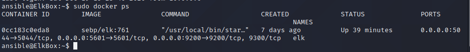

## Automated ELK Stack Deployment

The files in this repository were used to configure the network depicted below.


These files have been tested and used to generate a live ELK deployment on Azure. They can be used to either recreate the entire deployment pictured above. Alternatively, select yml files may be used to install only certain pieces of it, such as Filebeat.

This document contains the following details:
- Description of the Topology
- Access Policies
- ELK Configuration
  - Beats in Use
  - Machines Being Monitored
- How to Use the Ansible Build


### Description of the Topology

The main purpose of this network is to expose a load-balanced and monitored instance of DVWA, the D*mn Vulnerable Web Application.

Load balancing ensures that the application will be highly available, in addition to restricting access to the network.

Using a jump box ensures that only a single machine on the network needs to be exposed to the Internet for administration via SSH. Because the jump box is the only exposed machine, it is also the machine we can focus most of our hardening efforts.

Integrating an ELK server allows users to easily monitor the vulnerable VMs for changes to the syslogs and system metrics.
- Filebeat watches for changes to system logs, 
- Metricbeat monitors and reports on system metrics, such as CPU and RAM usage.

The configuration details of each machine may be found below.

| Name     | Function   | IP Address | Operating System | Contains                      |
|----------|------------|------------|------------------|-------------------------------|
| Jumpbox  | Gateway    | 10.0.0.6   | Ubuntu           | Ansible, Filebeat, Metricbeat |
| Web1     | Web server | 10.0.0.7   | Ubuntu           | DVWA, Filebeat, Metricbeat    |
| Web2     | Web server | 10.0.0.8   | Ubuntu           | DVWA, Filebeat, Metricbeat    |
| ELKbox   | ELK stack  | 10.1.0.4   | Ubuntu           | ELK stack                     |

### Access Policies

The machines on the internal network are not exposed to the public Internet. 

Only the Elkbox and Jumpbox machines can accept connections from the Internet. Access to these machines is only allowed from the following IP addresses:
- 184.144.111.154

Machines within the network can only be accessed by the Jumpbox at IP address 10.0.0.6.

A summary of the access policies in place can be found in the table below.

| Name    | Publicly Accessible | Allowed IP Addresses      |
|---------|---------------------|---------------------------|
| Jumpbox | Yes                 | 184.144.111.154           |
| Web1    | No                  | 10.0.0.5                  |
| Web2    | No                  | 10.0.0.5                  |
| ELKbox  | Yes                 | 10.0.0.5, 184.144.111.154 |

### Elk Configuration

Ansible was used to automate configuration of the ELK machine. No configuration was performed manually, which is advantageous because it allows for the configuration of multiple machines at once from a central location.

The playbook implements the following tasks:
- Install docker
- Install python3-pip
- Increase virtual memory used by VM
- Download and create a docker elk container
- Enable docker services on startup

The following screenshot displays the result of running `docker ps` after successfully configuring the ELK instance.



### Target Machines & Beats
This ELK server is configured to monitor the following machines:
- Jumpbox at `10.0.0.6`
- Web1 at `10.0.0.7`
- Web2 at `10.0.0.8`

We have installed the following Beats on these machines:
- Filebeat
- Metricbeat

These Beats allow us to collect the following information from each machine:
- Filebeat: Collects and monitors system logs. For example, we can use this to track successful and failed SSH logon events.
- Metricbeat: Monitors system use information, such as CPU and RAM usage.

### Using the Playbook
In order to use the playbook, you will need to have an Ansible control node already configured. Assuming you have such a control node provisioned: 

SSH into the control node and follow the steps below:
- Copy the `install-elk.yml` file to `/etc/ansible`.
  - `curl https://raw.githubusercontent.com/MeldrickRubang/first-repo/main/Ansible/install-elk.yml > /etc/ansible/install-elk.yml`
- Update the `/etc/ansible/hosts` file to include the IP address of the machine you wish to have elk installed on.
  - Add the following to `/etc/ansible/hosts`:
```[elk]
10.1.0.4 ansible_python_interpreter=/usr/bin/python3```
- Run the playbook, and navigate to `[ELK machine public IP address]:5601/app/kibana` to check that the installation worked as expected.
  - `ansible-playbook install-elk.yml`